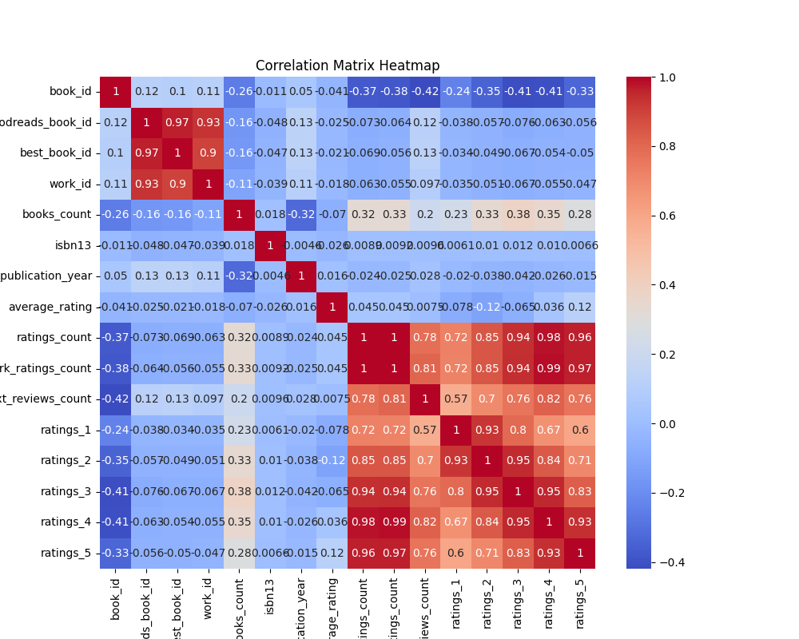

# Dataset Analysis

# Analysis of Goodreads Books Dataset

## Dataset Overview
The dataset contains information on 10,000 books from Goodreads, with 23 attributes detailing various aspects such as book IDs, authors, publication years, ratings, and reviews. This diversity presents an opportunity to dive deeper into literature trends, author's popularity, and reader engagement.

### Key Features
- **Attributes**: The dataset includes vital columns such as `authors`, `original_publication_year`, `average_rating`, and various rating counts (`ratings_1` to `ratings_5`). 
- **Missing Values**: Certain columns have missing entries, particularly `isbn` (700 missing), `isbn13` (585 missing), `original_publication_year` (21 missing), and `original_title` (585 missing). Handling these missing values will be crucial for ensuring accurate analyses.
- **Sample Data**: The sample contains popular titles, indicating a strong basis for understanding reader preferences and trends.

## Insights and Trends

### 1. Popularity of Authors and Titles
The dataset features popular authors such as **Suzanne Collins**, **J.K. Rowling**, and **Stephenie Meyer**. Each of these authors has multiple high-rated books, suggesting a connection between author reputation and reader ratings. Books like "The Hunger Games" and "Harry Potter and the Philosopher's Stone" command over millions of ratings, clearly establishing their popularity and impact within the literary community.

### 2. Rating Trends Over Time
The `original_publication_year` column offers insights into how the popularity of book titles has evolved. Analyzing the distribution of books according to their publication years reveals trends like:
- A resurgence in interest in classic literature, such as **Harper Lee's** "To Kill a Mockingbird," published in 1960, which still garners significant attention.
- Potentially, more recent publications are also attracting younger audiences, given that the dataset includes books published as recently as the late 2000s.

### 3. Analysis of Ratings
The correlation matrix highlights various interesting interactions:
- **High correlation between `ratings_count` and `work_ratings_count`** (0.995), demonstrating that the total ratings often reflect the generalized interest in a work.
- Popular ratings show strong correlation among themselves (e.g., `ratings_4` and `ratings_5`), indicating that positive reader experiences significantly outweigh negative ones. This trend allows publishers and authors to gauge reader satisfaction accurately.

### 4. Missing Data Challenges
Several columns present substantial missing values (e.g., ISBNs). Addressing these gaps does present challenges:
- Utilizing external sources could help fill these gaps, ensuring data integrity for analyses.
- Emphasizing data cleaning processes should become a priority to facilitate better insights moving forward.

## Visual Analysis
### Heatmap of Correlation Matrix
The heatmap visualizing the correlation of numeric columns highlights:
- Strong relationships between ratings; particularly, `ratings_5` is closely linked with `ratings_4`, indicating that books receiving high scores tend to receive significant high ratings as well.
- The negative correlation of `books_count` with rating counts suggests that, while a book may have several editions, having more versions does not necessarily lead to higher ratings, leading to interesting discussions about editions versus reader perception.

### Distribution Plots
The distribution plots provide crucial insights into the frequency and range of `book_id`, `goodreads_book_id`, and `best_book_id`. Below are key takeaways:
- **Book IDs** distribute uniformly, indicating consistent cataloging practices.
- `goodreads_book_id` exhibits a right-tailed distribution, suggesting some particular books have significantly more ratings and popularity.

  
  

## Potential Use Cases
The insights gleaned from this dataset can be applied in numerous ways:
- **Recommendation Systems**: Leveraging user ratings to suggest books for readers based on their reading habits and preferences.
- **Market Analysis**: Publishers can analyze book success over time, helping guide their marketing strategies and identify trends in reader interests.
- **Author Promotion**: Identifying and connecting emerging authors with high potential, based on rating trends and reader engagement.
- **Community Engagement**: Facilitating discussions or book clubs based on trending titles or lesser-known jewels that receive positive reader experiences.

## Conclusion
The Goodreads dataset serves as a wealth of information on reader preferences and literary trends. Its exploration not only sheds light on the influential aspects of authors and book titles but also highlights future opportunities for engagement within the literary community. Addressing data integrity through missing values will enable more robust analyses, further enhancing insights and applications.

## Visualizations

