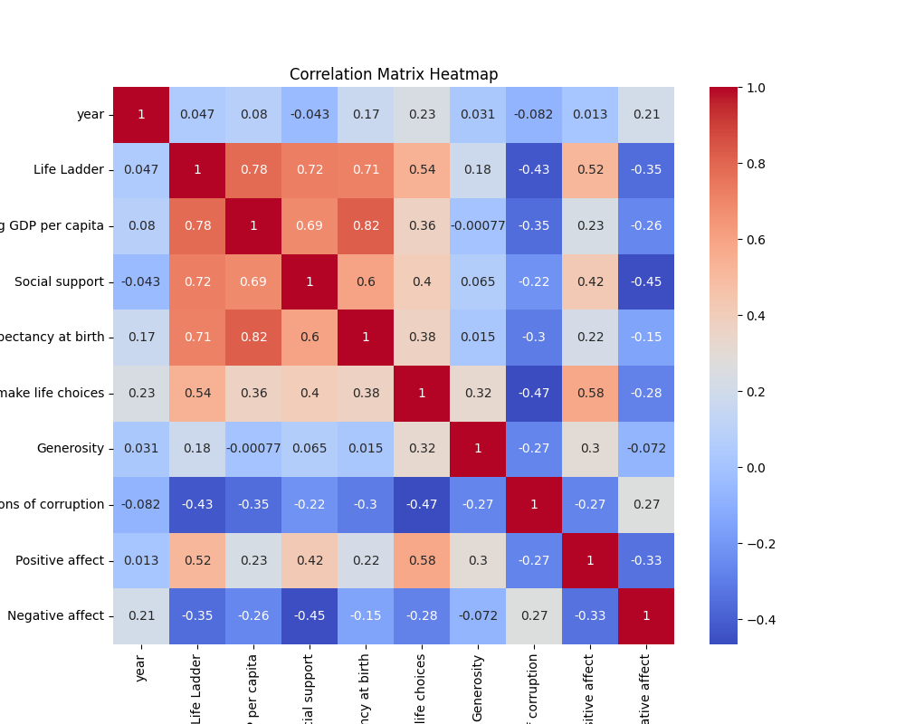
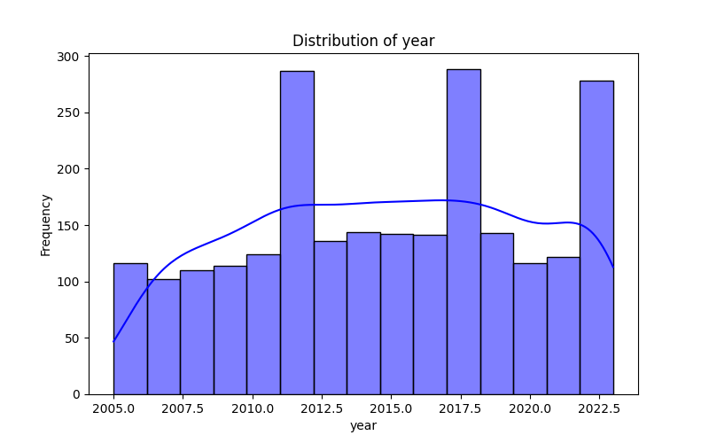

# Dataset Analysis

# Analysis of Global Happiness Indicators

## Dataset Overview

This analysis is based on a dataset comprising **2363 entries and 11 attributes** relevant to global happiness indicators across countries and years. The attributes include measurements of subjective well-being (Life Ladder), economic factors (Log GDP per capita), social support, and perceptions surrounding freedom, generosity, and corruption.

### Key Attributes:
- **Country Name**: The nation from which data is collected.
- **Year**: The year of observation.
- **Life Ladder**: A measure of subjective well-being.
- **Log GDP per capita**: A logarithmic scale of the economic capacity of individuals.
- **Social Support**: The perceived availability of assistance from family and friends.
- **Healthy Life Expectancy at Birth**: An estimate of overall population health.
- **Freedom to Make Life Choices**: The perceived freedom individuals feel they have in their lives.
- **Generosity**: The willingness to give to others.
- **Perceptions of Corruption**: Individuals' perspectives on corruption in their country.
- **Positive Affect** and **Negative Affect**: Indicators of emotional states experienced by individuals.

### Missing Values

There are some missing values in key attributes (Log GDP per capita, Social support, etc.), which may impact the analyses. Particularly, attributes like **Generosity (81 missing)** and **Perceptions of corruption (125 missing)** may skew insights related to social dynamics and trust.

## Insights and Trends

### Correlation Analysis

A comprehensive **correlation matrix** illustrates the relationships between these attributes:

- **Life Ladder** shows strong positive correlations with **Log GDP per capita** (0.78), **Social support** (0.72), and **Healthy life expectancy at birth** (0.71). This suggests that as a country's GDP increases, so does the reported well-being of its citizens, alongside better social support systems and health outcomes.
  
- **Negative correlation** with **Perceptions of corruption** (-0.43) indicates that countries perceived to have higher levels of corruption may report lower levels of happiness.

- **Freedom to make life choices** (0.54) also shows a significant positive relationship with **Life Ladder**, which implies the importance of personal agency in overall well-being.

### Distribution Analysis

The following distribution plots reveal important trends:

1. **Year Distribution**: There is a wide representation across multiple years, with certain peaks indicating years of heightened interest in documenting well-being metrics.

2. **Life Ladder Distribution**: This distribution showcases a **right skew**, suggesting that while many countries report a reasonable level of happiness, a significant number report challenges. 

3. **Log GDP per capita Distribution**: The distribution indicates a few countries with extremely high GDP per capita, which could correlate with well-being in the happier countries.

These visual insights can inform policymakers focused on socioeconomic improvements and distribution of resources.

## Use Cases and Recommendations

Given the rich data available, the following use cases are recommended:

1. **Policy Implications**:
   - Countries can strategize to enhance social support systems, manage economic disparities, and focus on corruption reduction which can significantly improve happiness indices.
   
2. **Further Research**: 
   - Understanding the dynamics of **Generosity** and **Perceptions of corruption** would provide deeper insights into societal trust and cohesion.
   
3. **Data-driven Decision Making**:
   - Policymakers should utilize this data to align resources not only for economic enhancement but also to bolster personal freedoms and social support mechanisms.

4. **Longitudinal Studies**:
   - Analyzing the trend of these indicators over decades could provide insights into how government policy impacts happiness scores over time.

## Conclusion

This dataset offers a wealth of information linking economic factors, social support, perceptions of corruption, and individual happiness across various nations. By understanding the connections between these indicators, stakeholders can develop more effective strategies to improve the quality of life, manage economic policies, and foster communal trust, contributing to the general well-being of societies globally. 

## Visualizations

