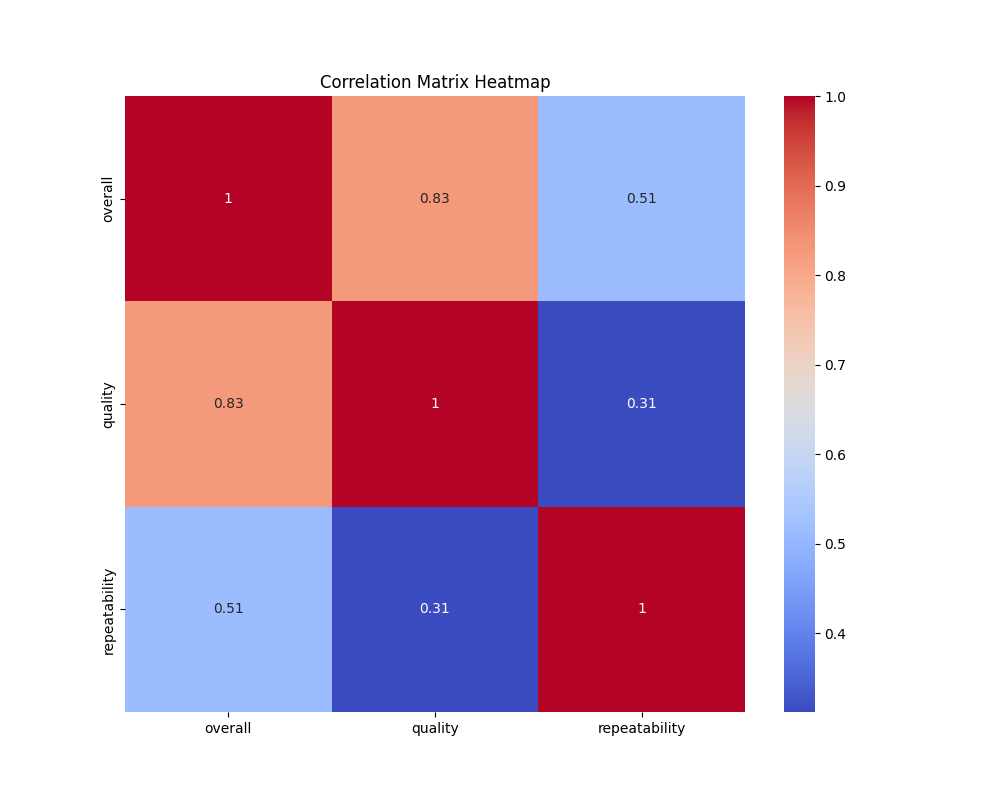
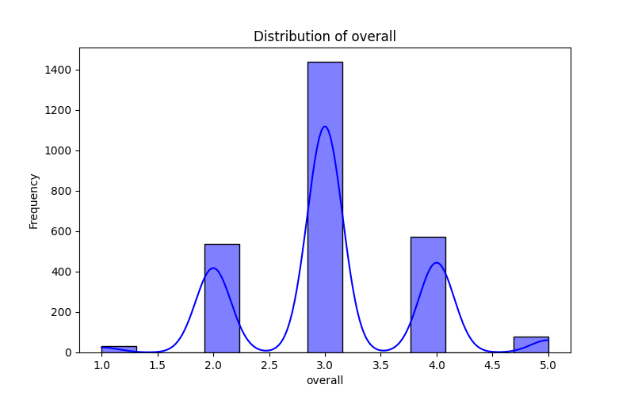
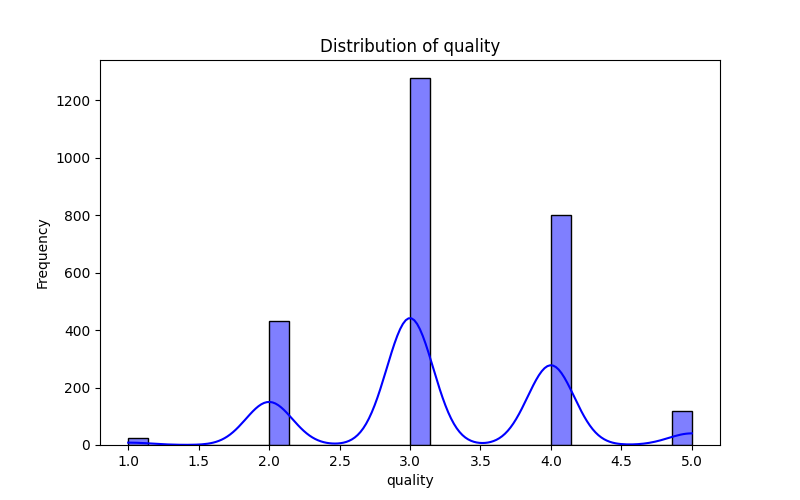
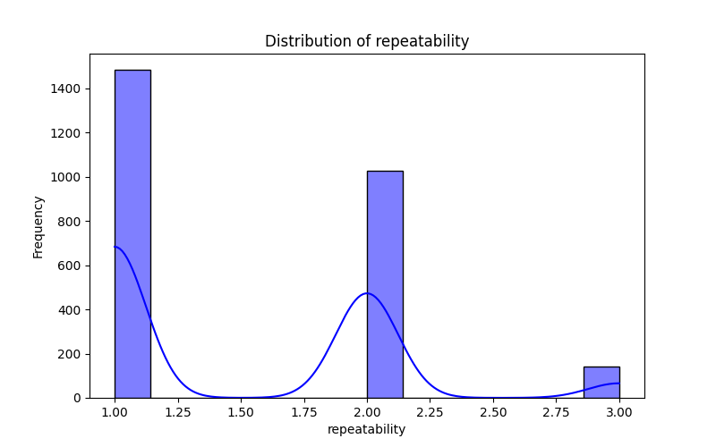

# Dataset Analysis

# Analysis Report: Media Dataset

## Overview

The dataset comprises 2,652 entries across 8 columns, namely `date`, `language`, `type`, `title`, `by`, `overall`, `quality`, and `repeatability`. This data serves as a rich source for analyzing trends in media ratings, particularly for movies across different languages.

## Missing Values

Before diving into insights, it's essential to address the missing values:

- **Date**: 99 entries are missing dates, which could affect time-based analyses.
- **By**: 262 entries lack information regarding the contributors (directors/actors), which might limit our ability to analyze contributions to ratings by specific individuals.

Efforts should be directed towards either cleaning or imputing these missing values to enhance the accuracy of any insights derived from this dataset.

## Sample Data

The dataset contains various movies with diverse contributors, ratings, and attributes. Here are a few notable samples:

1. **Meiyazhagan** (Tamil) - Overall: 4, Quality: 5
2. **Kushi** (Telugu) - Overall: 3, Quality: 3
3. **GOAT** (Tamil) - Overall: 3, Quality: 3

This sample indicates that most movies are rated significantly for both quality and overall experience, suggesting a general satisfaction among viewers.

## Correlations

The correlation matrix reveals significant relationships among the numeric columns:

- **Overall vs. Quality**: The correlation coefficient of 0.83 indicates a strong positive relationship, suggesting that as the quality rating increases, the overall rating tends to follow.
- **Overall vs. Repeatability**: With a correlation of 0.51, it appears that higher overall ratings are moderately associated with repeatability—viewers may be inclined to rewatch better-rated movies.
- **Quality vs. Repeatability**: Exhibiting a low to moderate correlation of 0.31, this suggests that quality ratings have some impact on the likelihood of rewatching but are not as strongly related as overall ratings.

### Visualization Insights

#### Correlation Heatmap

The heatmap illustrates the strength of correlations between the ratings, providing a quick visual reference to gauge how various factors interrelate.

#### Distribution Plots

The accompanying distribution plots (see below) provide insights into the spread of ratings:

- **Overall Distribution** 
- **Quality Distribution** 
- **Repeatability Distribution** 

From these plots, we observe:

1. **Overall Ratings**: Ratings tend to cluster around the middle, indicating a balance of both high and low ratings but with a slight leaning towards higher ratings.
2. **Quality Ratings**: Similar to overall ratings, quality ratings predominantly hover in the middle range but with fewer extremely low-quality ratings, suggesting that most movies are perceived positively.
3. **Repeatability**: The repeatability ratings are relatively skewed, with most movies being assigned a score of 1, indicating that viewers are not highly inclined to rewatch movies.

## Insights & Trends

1. **Positive Viewer Sentiment**: The high correlation between overall and quality ratings signifies strong viewer sentiment toward well-produced films, implying that improving the quality could lead to better overall ratings.
  
2. **Repeatability Concerns**: The low values in repeatability suggest that although quality is appreciated, the desire to rewatch may be limited. This trend can offer insights for filmmakers looking to enhance their storytelling or entertainment value to increase rewatch potential.

3. **Diverse Language Representation**: The dataset covers multiple languages, providing the opportunity to analyze regional preferences and responses to movies, which could inform localized marketing strategies in the entertainment industry.

## Potential Use Cases

1. **Recommendation Systems**: Insights from this dataset could be utilized to develop recommendation algorithms for streaming services, enhancing user experience by suggesting films based on viewer preferences and ratings.

2. **Market Research**: Film studios could use sentiment analysis of ratings to refine their production strategies, focusing on elements that correlate with higher viewer satisfaction and rewatchability.

3. **Content Optimization**: Filmmakers could analyze the dataset to create films that resonate well with audiences by focusing on high-quality production elements known to yield better ratings.

## Conclusion

This dataset is a valuable tool for gleaning insights into the film industry's landscape, emphasizing viewer satisfaction driven by quality. By addressing the missing values and leveraging the significant correlations, stakeholders can make informed decisions aimed at enhancing experiences within the media landscape.

## Visualizations

